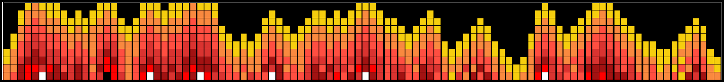

> This fire image was created with my JavaScript and HTML [fire demo](https://github.com/tyler-daigle/fire-demo) 

# Hello There

My name is Tyler and I am a web developer who enjoys creating interesting
things using Vue.js and JavaScript.

## Some things I have made

  - [A budget predictor app](https://github.com/tyler-daigle/budget-predictor) using Vue.
  - [A Fallout Password Hacking Game](https://github.com/tyler-daigle/fallout-game).
  - [An Amateur Radio Exam Creator](https://github.com/tyler-daigle/ham-exam-fe).
  - [A Countdown to Halloween Badge Creator](https://github.com/tyler-daigle/halloween-countdown).

## Some things about me

  - 👻 I am a huge horror fan and would love to have a job that has something to do with horror (podcasts, websites, movies, etc).
  - 🐈‍⬛ I have one black cat.
  - 🎮 I started programming in C because I wanted to be a game programmer.
  - 🎃 Halloween is my favorite time of the year.
  - 🤦‍♂️ I once created a Tetris clone in python (with sounds and everything) that worked great... but I somehow managed to delete the entire codebase.

## My Site

You can view more of my projects and writing at [tdaigle.com](https://tdaigle.com)

I also have a [codepen.io](https://codepen.io/tdaigle) where I like to try out some ideas I have.

---

<!--
**tyler-daigle/tyler-daigle** is a ✨ _special_ ✨ repository because its `README.md` (this file) appears on your GitHub profile.

Here are some ideas to get you started:

- 🔭 I’m currently working on ...
- 🌱 I’m currently learning ...
- 👯 I’m looking to collaborate on ...
- 🤔 I’m looking for help with ...
- 💬 Ask me about ...
- 📫 How to reach me: ...
- 😄 Pronouns: ...
- ⚡ Fun fact: ...
-->
