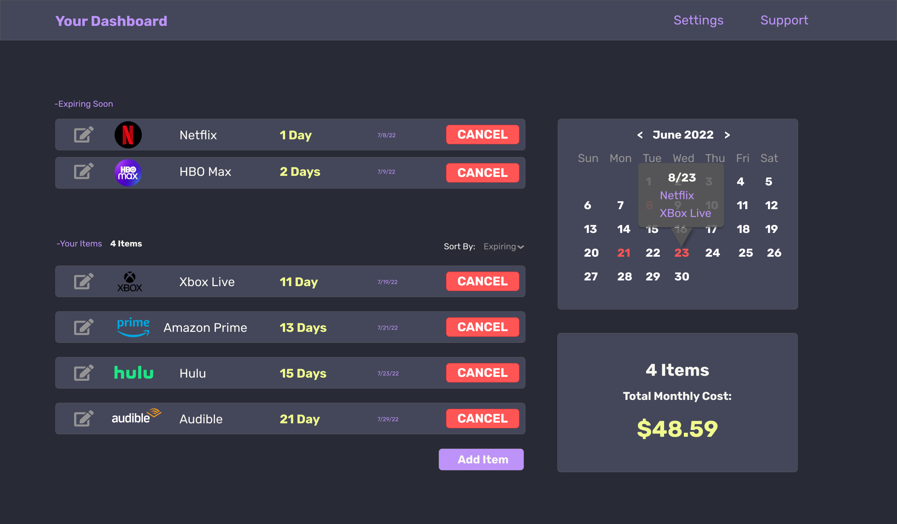
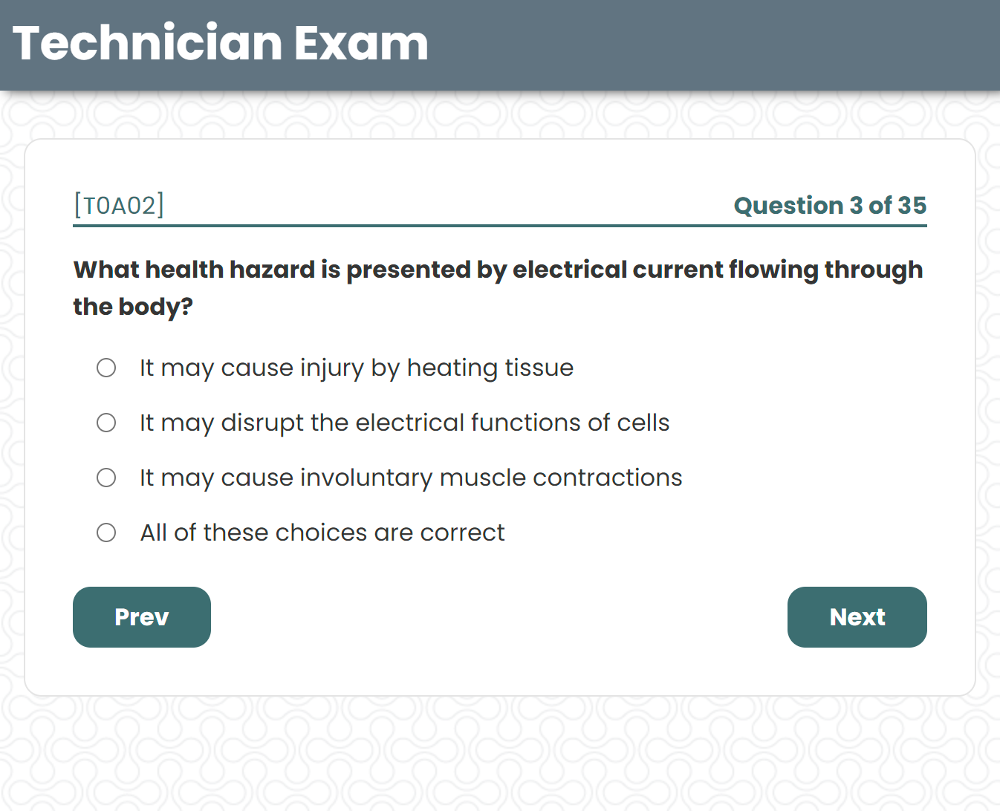

# About Me

Hello, my name is Tyler and I am a **front end web developer** focusing on React.

## Some Of My Skills

      

# My Links

- 
- 

# My Projects

## Cancel Reminder

**Cancel Reminder** is a web app that keeps track of services you are subscribed to, such as
Netflix or Hulu. It will remind you when to cancel your subscription before you are charged
for a new month.

Tech Used:

- Next.js
- Firebase

## <!-- This is still a work in progress but a small demo is available at:  -->

## Ham Exam Practice

The purpose of this project is to create a website that allows you to practice for the amateur radio exams. Using this site you can take an exam that is made up of the same question pools that are provided by the FCC for the real exams. You can practice the Technician, General and Amateur Extra exams.

It was created with **React**. All of the questions are hosted on **Contentful**.

The site is hosted at [amateur-radio.school](https://amateur-radio.school).

The code is available on [Github](https://github.com/tyler-daigle/practice-ham).

---

